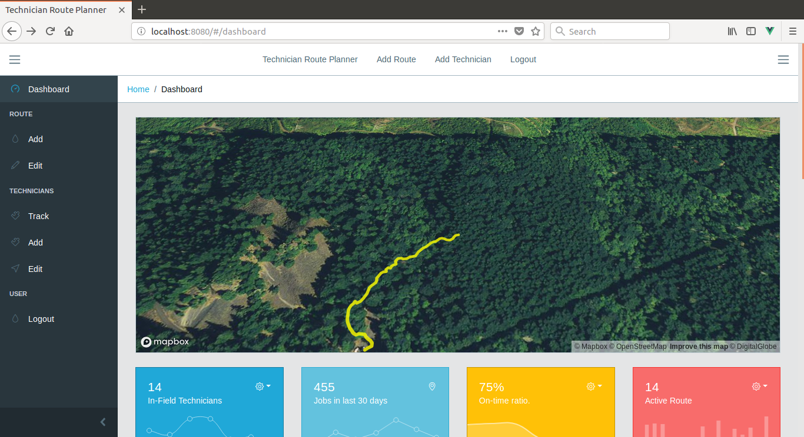

#  Docker Golang Protobuf MongoDB NPM Vuejs CoreUI
## Technician Route Planner Demo App

Docker Golang Protobuf MongoDB NPM Vuejs is created as a demo project for my portfolio.
If you are interested in hiring me for work please email me at robscodebase@gmail.com.

Unless otherwise noted, these source files are distributed under the
BSD-style license found in the LICENSE file.

### Clone Repo

You must have Docker and Docker-Compose installed on your machine.
* Clone repo.
  * `git clone https://github.com/robscodebase/technicianrouteplanner.git`

### Run Docker-Compose

* Navigate to /technicianrouteplanner
  * `sudo docker-compose up`

### View App

* Open browser and navigate to localhost:8080/

### Included Languages.
* Golang
* GRPC
* Protobuf
* Nodejs
* Javascript
* NPM
* Webpack
* Mapbox api
* Vuejs
* Docker
* MongoDB
* CoreUI

